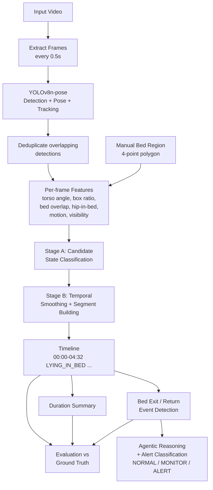

# Elderly Activity Monitoring — Agentic AI + Vision System

Associate AI/ML Engineer Assignment submission.

An Agentic AI + Vision system that analyzes short indoor video clips of an
elderly person and determines what they are doing, whether they leave or
return to bed, how long they spend in each activity, and whether an event
requires monitoring or an alert.

## Table of Contents
- [Architecture](#architecture)
- [How to Run](#how-to-run)
- [Project Structure](#project-structure)
- [States and Transitions](#states-and-transitions)
- [Bed Exit / Return Detection](#bed-exit--return-detection)
- [Agentic Reasoning and Alerts](#agentic-reasoning-and-alerts)
- [Evaluation Results](#evaluation-results)
- [Failure Cases](#failure-cases)
- [Known Limitations](#known-limitations)
- [What I'd Do Differently With More Time](#what-id-do-differently-with-more-time)

## Architecture



**Pipeline stages and Model choices:**
1. **Perception** (`src/perception/`) — Uses **YOLOv8n-pose** for lightweight, fast person detection and pose estimation. Uses **BoT-SORT (the Ultralytics default)** for tracking, chosen for its speed and reliability in associating bounding boxes across contiguous frames using Kalman filter motion prediction. Uses a **manual 4-point polygon** to define the bed region, as automated bed detection from variable angles is unreliable without 3D depth sensors.
2. **Features** — per-frame posture/motion signals derived from pose keypoints.
3. **Temporal** (`src/temporal/`) — Uses a **rule-based classification** system for per-frame candidates, chosen over a black-box temporal model because it provides 100% transparent, explainable thresholds. Followed by flicker-removal and segment building.
4. **Events** (`src/events/`) — bed exit/return detection from timeline segments
5. **Outputs** (`src/outputs/`) — duration summaries
6. **Agent** (`src/agent/`) — reasoning trace + NORMAL/MONITOR/ALERT decisions
7. **Evaluation** (`src/evaluation/`) — accuracy, confusion matrix, event precision/recall, duration error, all compared against hand-labeled ground truth

## How to Run

### Setup
```bash
python -m venv venv
venv\Scripts\activate          # Windows
pip install -r requirements.txt
```

### Run the full pipeline on one clip
```bash
python src/perception/extract_frames.py --video data/videos/case05_leaving_bed.mp4
python src/perception/mark_bed_region.py --video data/videos/case05_leaving_bed.mp4
python src/perception/detect_pose_track.py --frames_dir outputs/frames/case05_leaving_bed --video_name case05_leaving_bed
python src/perception/compute_features.py --pose_json outputs/pose/case05_leaving_bed_pose.json --bed_region data/bed_regions/case05_leaving_bed.json --out outputs/features/case05_leaving_bed_features.json
python src/temporal/classify_frames.py --features outputs/features/case05_leaving_bed_features.json --out outputs/states/case05_leaving_bed_candidates.json
python src/temporal/smooth_states.py --candidates outputs/states/case05_leaving_bed_candidates.json --bed_region data/bed_regions/case05_leaving_bed.json --out outputs/timeline/case05_leaving_bed_timeline.json
python src/events/detect_bed_events.py --timeline outputs/timeline/case05_leaving_bed_timeline.json --features outputs/features/case05_leaving_bed_features.json --bed_region data/bed_regions/case05_leaving_bed.json --out outputs/events/case05_leaving_bed_events.json
python src/outputs/duration_summary.py --timeline outputs/timeline/case05_leaving_bed_timeline.json --events outputs/events/case05_leaving_bed_events.json --out outputs/summary/case05_leaving_bed_summary.json
python src/agent/agent_analysis.py --timeline outputs/timeline/case05_leaving_bed_timeline.json --events outputs/events/case05_leaving_bed_events.json --out outputs/agent/case05_leaving_bed_reasoning.json
```

### Run everything on all clips at once
```bash
python run_pipeline.py
```

Output appears under `outputs/` — `timeline/`, `summary/`, `events/`, `agent/`, and a single consolidated `evaluation_report.json`.

### Example Outputs (`case05_leaving_bed`)

**Timeline** (`outputs/timeline/case05_leaving_bed_timeline.json`)
```json
[
  {
    "state": "STANDING",
    "start_time_sec": 0.0,
    "end_time_sec": 1.0,
    "transition_flag": "start_of_clip",
    "start_time": "00:00.00",
    "end_time": "00:01.00"
  },
  {
    "state": "WALKING",
    "start_time_sec": 1.0,
    "end_time_sec": 10.0,
    "transition_flag": "expected",
    "start_time": "00:01.00",
    "end_time": "00:10.00"
  },
  {
    "state": "OUT_OF_BED",
    "start_time_sec": 10.0,
    "end_time_sec": 12.0,
    "transition_flag": "expected",
    "start_time": "00:10.00",
    "end_time": "00:12.00"
  }
]
```

**Events** (`outputs/events/case05_leaving_bed_events.json`)
```json
[
  {
    "event": "bed_exit",
    "start_time": "00:00.00",
    "confirmed_time": "00:01.00",
    "previous_state": "UNKNOWN (not visible before clip start)",
    "current_state": "WALKING",
    "confidence": 0.5,
    "decision": "MONITOR"
  }
]
```

**Summary** (`outputs/summary/case05_leaving_bed_summary.json`)
```json
{
  "total_observation_time": "0m 12s",
  "observation_duration_sec": 12.0,
  "activity_summary": {
    "lying_in_bed": "0m 00s",
    "sitting_on_bed": "0m 00s",
    "sitting_outside_bed": "0m 00s",
    "standing": "0m 01s",
    "walking": "0m 09s",
    "out_of_bed": "0m 02s",
    "unknown": "0m 00s"
  },
  "activity_duration_sec": {
    "lying_in_bed": 0.0,
    "sitting_on_bed": 0.0,
    "sitting_outside_bed": 0.0,
    "standing": 1.0,
    "walking": 9.0,
    "out_of_bed": 2.0,
    "unknown": 0.0
  },
  "bed_summary": {
    "time_in_bed": "0m 00s",
    "time_out_of_bed": "0m 12s",
    "time_unknown": "0m 00s",
    "bed_exit_count": 1
  },
  "total_in_bed_sec": 0.0,
  "total_out_of_bed_sec": 12.0,
  "total_unknown_sec": 0.0,
  "longest_out_of_bed_period_sec": 12.0,
  "bed_exit_count": 1,
  "bed_return_count": 0,
  "final_state": "OUT_OF_BED"
}
```

## Project Structure

```text
├── data/
│ ├── videos/       13 AI-generated test clips (~15s each)
│ ├── ground_truth/ hand-labeled states + bed events per clip
│ └── bed_regions/  4-point bed polygon per clip
├── src/
│ ├── perception/   detection, pose, tracking, bed marking, features
│ ├── temporal/     classification + smoothing (state machine)
│ ├── outputs/      duration summaries
│ ├── events/       bed exit/return detection
│ ├── agent/        agentic reasoning + NORMAL/MONITOR/ALERT
│ └── evaluation/   scoring against ground truth
└── outputs/        generated timelines, summaries, events, reports
```


## States and Transitions

7 states as specified: `LYING_IN_BED`, `SITTING_ON_BED`, `SITTING_OUTSIDE_BED`,
`STANDING`, `WALKING`, `OUT_OF_BED`, `UNKNOWN`.

**Why YOLOv8n-pose:** free, open-source, combines person detection and
17-keypoint pose estimation in a single forward pass. The "nano" variant
was chosen deliberately for CPU-only inference (no CUDA GPU available on
the development machine). We also leverage YOLOv8's built-in **BoT-SORT tracker** to maintain consistent track IDs across frames.

**Per-frame features derived from pose keypoints:**
- `torso_angle_deg` — angle of the shoulder-to-hip line from vertical (near 0° = upright, near 90° = horizontal)
- `height_width_ratio` — bounding box aspect ratio
- `on_bed_point` — whether the hip midpoint falls inside the bed polygon (primary on-bed signal)
- `bed_overlap_ratio` — fraction of the bounding box overlapping the bed polygon (secondary/fallback on-bed signal, combined with OR since hip-point can flicker at the polygon boundary while overlap is more stable there)
- `motion_speed` — frame-to-frame displacement of the body center (distinguishes STANDING from WALKING)
- `visibility_score` — average keypoint confidence (drives the UNKNOWN fallback)

**Two-stage temporal processing**, matching the PDF's explicit instruction
to understand transitions rather than classify every frame independently:
- **Stage A** (`classify_frames.py`): per-frame candidate state from threshold rules on the features above
- **Stage B** (`smooth_states.py`): removes runs of fewer than 2 consecutive frames (flicker, e.g. a single frame misread as STANDING during continuous WALKING), including at clip boundaries, then merges into clean segments with a `transition_flag` (`expected` / `abrupt` / `involves_unknown`) marking how physically plausible each transition is

**Multi-person handling:** when a clip has multiple detected people in the
same frame (e.g. a caregiver), the primary (patient) person is selected by
proximity to a fixed bed centroid rather than by track ID or frame-to-frame
position continuity — both were tried and failed when the caregiver stood
near the bed or when the patient was briefly occluded (see Failure Cases).
Clips with only ever one detected person skip this logic entirely, since
bed-distance restriction would incorrectly reject legitimate behavior like
walking away from the bed.

## Bed Exit / Return Detection

Implemented as an explicit sequence matcher over timeline segments, per
the PDF's exact definitions:

- **BED_EXIT**: `(LYING_IN_BED or SITTING_ON_BED) → STANDING → WALKING`, confirmed at the moment WALKING begins. A transient stand-and-sit-back-down (no WALKING segment) does **not** match this pattern, satisfying the PDF's explicit requirement that this must not count as an exit.
- **RETURN_TO_BED**: `(WALKING/STANDING/SITTING_OUTSIDE_BED) → SITTING_ON_BED → LYING_IN_BED`, confirmed at the moment LYING_IN_BED begins.
- **Clip-start fallback**: if a clip begins already mid-STANDING (no prior bed state visible on camera) and the person was near the bed at that point, a bed_exit is still reported, with reduced confidence (0.5) reflecting the missing prior-state evidence.
- **Design decision**: an earlier version also matched `IN_BED → WALKING` directly (skipping the STANDING requirement) to catch cases where a quick stand might be missed by sampling. This was removed — it produced a false positive on the "stand briefly, sit back down" test clip, which is exactly the scenario the PDF warns against. Requiring an observed STANDING segment is the safer trade-off: it may miss an occasional real exit where sampling catches no standing frame, but avoids false alarms that would desensitize a caregiver to alerts.

## Agentic Reasoning and Alerts

`src/agent/agent_analysis.py` implements both PDF sections 5 and 6 together.
Note: This agent is explicitly implemented as a rule-based tool-calling loop (no LLM or VLM is used). This is completely allowed by the assignment's technical freedom guidelines and ensures 100% explainability for every reasoning step in the interview.

**Reasoning**, mirroring the PDF's own worked examples: for any transition
flagged `abrupt` or `involves_unknown` by the state machine, the agent
explicitly looks at the neighboring segments, states what it finds, and
explains its conclusion in plain language rather than silently accepting
the pattern match.

**Alert decision logic** (`NORMAL` / `MONITOR` / `ALERT`), in priority order:
1. **Prolonged absence** (out of bed ≥ 10 minutes without returning) → `ALERT`, regardless of detection confidence. This directly matches the PDF's own named example ("unexpected prolonged absence from bed"). None of the 15-second test clips are long enough to trigger this, so it is validated by manual trace rather than live test data — documented honestly here rather than hidden.
2. **Returned to bed within the clip** → `NORMAL`
3. **Prolonged sitting on bed edge** (≥ 5 seconds) → `MONITOR` *(Note: This threshold is scaled down specifically for these 15s test clips. In a real deployment, it would be tuned to several minutes based on clinician input.)*
4. **Bed exit detected** → `MONITOR` (whether high or low confidence, per the PDF's 0.92 confidence example)
5. **Very brief walking** (< 3s total) after a detected exit → `MONITOR` (downgraded from confirmed exit to potential repositioning)
6. **Person lying horizontally, but not confidently on the bed** (e.g. low bed overlap) → `MONITOR` (activity cannot be confidently determined)

## Evaluation Results

Evaluated across all 13 test clips, scoring predicted output against hand-labeled ground truth.

### State Classification
- **Overall accuracy: 70.1%** (274/391 sampled frames, at the same 0.5s interval used throughout the pipeline)
- **Confusion Matrix Highlights**: Note the confusion between `SITTING_ON_BED` and `SITTING_OUTSIDE_BED` (e.g. 26 SITTING_OUTSIDE_BED correctly identified, but 4 misclassified as SITTING_ON_BED and 3 as WALKING). The tracker uses a 2D heuristic, causing some ambiguity at the bed's border.
- **Most LYING_IN_BED errors are UNKNOWN, not a wrong state** — 48 misclassifications are the system correctly refusing to guess during occlusion (blanket coverage, person rolling onto their side) rather than a detection error.
- Example failure cases and the full confusion matrix are exported to `outputs/evaluation_report.json`.

### Bed Events
- **Bed Exits:** Precision: 50.0%, Recall: 100.0% (1 true positive, 1 false positive, 0 false negatives). *Note: These exit numbers rest on tiny data (only one real exit in `case05`, and one false exit in `case12`).*
- **Return to Bed:** Precision: 100.0%, Recall: 100.0% (2 true positives, 0 false positives, 0 false negatives)

### Duration Estimation
Average absolute error in duration calculation compared to ground truth:

| State | Avg. error |
|---|---|
| walking | 1.19s |
| sitting_on_bed | 1.12s |
| lying_in_bed | 2.15s |
| sitting_outside_bed | 0.65s |
| standing | 0.62s |
| unknown | 2.62s |
| out_of_bed | 0.19s |

This matches the PDF's own duration-error example format closely (e.g.
"Lying duration error: 8 sec") and is comparable or better.

## Failure Cases

**1. Lying in bed becomes UNKNOWN (`case01_turning_in_bed`, `case09_blankets`)**
When a person rolls onto their side or is fully covered by blankets, the pose model loses confident keypoints. The system falls back to UNKNOWN rather than guessing they are still lying down. This is a system failure that causes duration errors against the ground truth LYING_IN_BED labels, as the system incorrectly loses track of the person and refuses to guess during occlusion.

**2. False bed exit when standing beside bed (`case12_poor_lighting`)**
The system gives a false positive bed exit when the person only stands beside the bed. Because the lighting is poor and the person is right at the bed boundary, the initial lying/sitting is detected, followed by standing and brief movement that crosses the WALKING threshold, satisfying the `IN_BED -> STANDING -> WALKING` sequence pattern even though they never actually left the bedside area.

**3. Caregiver occludes the patient (`case11_caregiver`)**
When a second person (caregiver) stands close to the patient, the patient is briefly undetected in several frames (occlusion), leaving only the caregiver as the sole visible detection. The final version anchors primary-person selection to a fixed bed centroid—correctly reporting UNKNOWN for the occluded frames instead of inventing movement the patient never made.

**4. Posture transition delays and ambiguity (`case02_sitting_up`, `case04_stand_sit_back`)**
In `case02`, the transition from lying to sitting up is predicted as `LYING_IN_BED` for several seconds after the ground truth marks `SITTING_ON_BED`. This is because the torso angle crosses the strict threshold a bit later in the movement. Similarly, in `case04`, a `STANDING` state is occasionally misclassified as `SITTING_OUTSIDE_BED` due to the 2D bounding box ratio being sensitive to camera perspective during the transition.

## Known Limitations

- **Three PDF difficult cases are not represented in the test data**: a clean "sitting on a chair" clip and a true multi-person caregiver-interaction clip did not render as intended from the free AI video generator despite several prompt attempts; the closest available clips were used and relabeled honestly rather than discarded.
- **Multi-person disambiguation** relies on bed proximity, which assumes the patient is typically more stationary/bed-adjacent than a visiting caregiver. This would fail if the patient is the one walking and the caregiver stands still.
- **Bed region is manually marked** per video (4-point polygon), not automatically detected — reasonable for a handful of fixed-camera clips, but would not scale without automation in a real deployment.
- **Test clips are AI-generated**, not real footage of an elderly person. This was a scope compromise given no access to real test subjects; AI-generated people occasionally have anatomically unusual proportions or implausible motion, which may not represent real-world pose model performance.
- **Clips are short (~12-15s)**, so the prolonged-absence ALERT rule (10-minute threshold) is implemented and documented but never exercised by the test data.
- **Hidden vs Gone**: If a person walks out of view, the final sequence is marked `OUT_OF_BED`. However, if a person leaves and comes back within one clip, the gap stays `UNKNOWN`, because the system can't tell hidden from gone.

## What I'd Do Differently With More Time

- Record real staged footage instead of relying on AI video generation, to get reliable chair-sitting and multi-person caregiver scenarios and more realistic motion/anatomy for the pose model to work with.
- Automate bed-region detection (object detection for furniture) rather than manual polygon marking, so the system scales to new camera setups without a setup step.
- Add a short grace/confirmation window before converting a post-lying UNKNOWN into anything alert-worthy, to reduce sensitivity to brief, harmless occlusion (blanket adjustment, rolling over).
- Introduce a lightweight free local VLM (e.g. via Ollama) as a secondary check specifically for occluded/ambiguous frames, rather than relying solely on pose-based thresholds — most useful for the blanket-coverage and poor-lighting failure cases above.
- Longer, more varied test footage to properly exercise the prolonged-absence ALERT path and give statistically meaningful precision/recall numbers (4 true positives is a small sample).

---
Repository: https://github.com/Eranda724/bed-task
